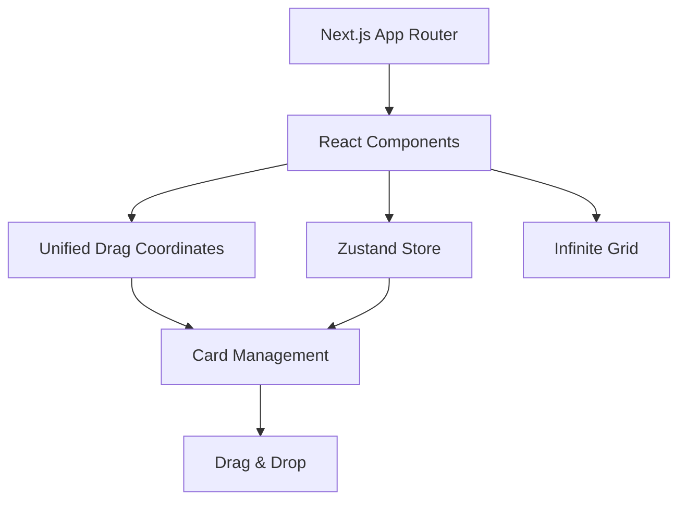

# 🧩 Narabell - プロジェクト全体像

## 📋 サービス概要

**Narabell**は、グリッド構造上でシンプルな「図形カード (shape)」を配置し、PowerPointの図形と同様に直接テキスト入力できる最小MVPを提供するWebアプリケーションです。将来は複数コンテンツタイプへ段階的に拡張予定です。

---

## 🎯 コアコンセプト
```
秩序ある構造 × 最小限の要素 = 拡張しやすいワークスペース基盤
```

### 現在のフォーカス (MVP)
- 🧱 単一カードタイプ: 四角形 (shape)
- ✍️ プレーンテキスト編集 (ダブルクリックで編集開始 / Cmd+Enter保存 / Esc取消)
- 📐 グリッド + スナップ
- 🧲 統一座標計算API (dragCoordinates.ts)
- 🖱️ ドラッグ&ドロップ / 無限キャンバス / ズーム・パン

将来的な追加 (保留中): 画像 / リスト / チャート / リンク / カレンダー 等

---

## 🏗️ システムアーキテクチャ


---

## 🔧 技術スタック概要
```typescript
Framework: Next.js 15+ (App Router)
Language: TypeScript (Strict)
Styling: Tailwind CSS v4
State: Zustand
UI: shadcn/ui
D&D: @dnd-kit/core
Pkg: pnpm
```

---

## 📱 UI構成 (MVP)
```
┌───────────────────────────────┐
│ 🔔 Narabell (ToolPalette)     │  ← 四角形カードのみ
├───────────────────────────────┤
│  無限キャンバス (ズーム/パン) │
│   ▭  ▭  ▭  ▭  ▭               │
│   (ダブルクリックで編集)       │
└───────────────────────────────┘
```

### カード種別 (現状態)
- ■ shape: 単純な四角形 + プレーンテキスト

---

## ✍️ カード編集 UX 仕様
- ダブルクリック: 編集開始
- フォーカスアウト / Cmd+Enter: 保存
- Esc: 編集前に戻してキャンセル
- 空テキスト時はプレースホルダー表示

---

## 📊 データモデル (抜粋)
```ts
// types/board.ts
export type CardType = 'shape'
interface ShapeContent { text: string; fontSize: number; fontWeight: 'normal'|'bold'; textAlign: 'left'|'center'|'right'; color: string }
```

---

## 🚀 ロードマップ (要約)
Phase 1 (完了中):
- ✅ 単一shapeカード + テキスト編集
- ✅ 座標計算統一API
- ✅ 不要コード/旧カードタイプ削除

Phase 2 (予定):
- 🔄 エクスポート機能再統合 (Markdown等)
- 🎨 スタイル編集 (色/枠/影)

Phase 3+ (構想):
- 🧩 複数カードタイプ再導入
- 🤝 コラボレーション
- 📤 PPTX / PDF / 画像エクスポート

---

## 🧪 テスト指針
- 座標計算: `dragCoordinates.test.ts` の網羅維持
- 追加仕様は失敗テスト→実装→リファクタのTDDサイクル

---

## 🔒 設計原則 (MVP適用版)
1. 単一データモデルで拡張余地を確保
2. 依存の最小化（座標計算は単一ファイル）
3. UIとロジックの分離（store / lib / components）
4. 将来の複数タイプ化を想定した最小インターフェース維持

---

最終更新: 2025-09-14
(本ドキュメントは単一 shape カード版に更新済み)
