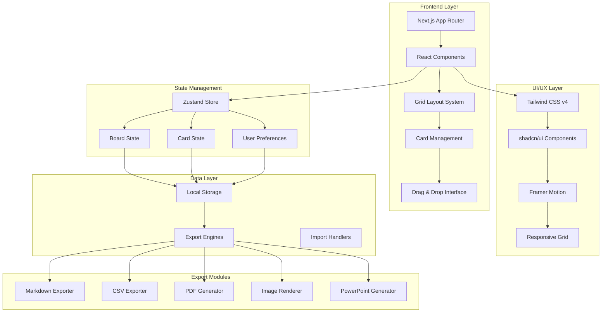

# 🧩 Narabell - プロジェクト全体像

## 📋 サービス概要

**Narabell**は、グリッド構造上でカード型オブジェクトをパズルのように組み合わせて配置できる革新的なウェブアプリケーションです。秩序ある構造と柔軟な創造性を両立し、視覚的に整理された情報管理とコラボレーションを実現します。

---

## 🎯 コアコンセプト

```
秩序ある構造 × 柔軟な創造性 = 新しいデジタルワークスペース
```

### 独自性・差別化ポイント
- 🎲 **グリッド構造 × 自由なカード操作**: 視覚的秩序と操作の自由度を両立
- 🧩 **パズル感覚のUI体験**: 他に類を見ないニッチな価値提案
- 📤 **多様な出力形式**: Markdown、CSV、PDF、PowerPoint、画像エクスポート対応

---

## 🏗️ システムアーキテクチャ



---

## 🔧 技術スタック詳細

### フロントエンド Core
```typescript
// 主要技術構成
Framework: Next.js 15+ (App Router)
Language: TypeScript (Strict Mode)
Styling: Tailwind CSS v4
UI Library: shadcn/ui
Package Manager: pnpm
```

### インタラクション & レイアウト
```typescript
// グリッド & ドラッグ機能
"react-grid-layout": "^1.4.0"        // レスポンシブグリッドシステム
"@dnd-kit/core": "^6.0.0"            // モダンなドラッグ&ドロップ
"framer-motion": "^10.0.0"           // スムーズアニメーション
"react-resizable": "^3.0.0"          // カードリサイズ機能
```

### データ処理 & エクスポート
```typescript
// 出力エンジン
"jspdf": "^2.5.0"                     // PDF生成
"html2canvas": "^1.4.0"               // 画像エクスポート
"papaparse": "^5.4.0"                 // CSV処理
"remark": "^14.0.0"                   // Markdown処理
"pptxgenjs": "^3.12.0"                // PowerPoint生成
"zustand": "^4.4.0"                   // 軽量状態管理
```

---

## 📱 ユーザーインターフェース構成

### メインボードビュー
```
┌─────────────────────────────────────────────────────────────┐
│ 🔔 Narabell                      🔧 ⚙️ 📤 👤              │
├─────────────────────────────────────────────────────────────┤
│ 📋 ツールパレット                                            │
│ ┌───┐ ┌───┐ ┌───┐ ┌───┐                                    │
│ │📝 │ │📊 │ │🖼️ │ │📋 │ + カード追加                      │
│ └───┘ └───┘ └───┘ └───┘                                    │
├─────────────────────────────────────────────────────────────┤
│                    🎯 メインワークスペース                    │
│  ┌─────────┐  ┌───────────────┐  ┌─────────┐               │
│  │  Card 1 │  │    Card 2     │  │  Card 3 │               │
│  │  📝 Note│  │   📊 Chart    │  │  🖼️ Image│              │
│  │         │  │               │  │         │               │
│  └─────────┘  └───────────────┘  └─────────┘               │
│                                                             │
│  ┌─────────────────┐  ┌─────────┐                          │
│  │     Card 4      │  │  Card 5 │                          │
│  │   📋 List       │  │  📝 Todo│                         │
│  │                 │  │         │                          │
│  └─────────────────┘  └─────────┘                          │
└─────────────────────────────────────────────────────────────┘
```

### カード種別
- **📝 テキストカード**: リッチテキスト編集対応
- **📊 データカード**: チャート・グラフ表示
- **🖼️ メディアカード**: 画像・動画埋め込み
- **📋 リストカード**: チェックリスト・タスク管理
- **🔗 リンクカード**: URL・参照リンク
- **📅 カレンダーカード**: 日程・スケジュール

---

## 🔄 主要機能フロー

### 1. カード操作フロー
```
カード作成 → グリッド配置 → サイズ調整 → コンテンツ編集 → 配置調整
     ↓              ↓           ↓            ↓           ↓
  テンプレート選択  自動スナップ  リアルタイム反映  保存       エクスポート
```

### 2. エクスポートフロー
```
ボード完成 → エクスポート形式選択 → データ変換 → ファイル生成 → ダウンロード
     ↓              ↓                ↓          ↓           ↓
  プレビュー   Markdown/CSV/PDF/PPTX  最適化処理   品質確認     完了
```

### 3. PowerPoint出力フロー
```
グリッドボード → スライド分割設定 → レイアウト最適化 → PPTX生成 → プレゼン準備
     ↓              ↓               ↓              ↓           ↓
  カード配置      自動スライド化    テンプレート適用   品質確認    発表可能
   ・1カード = 1スライド
   ・複数カード = 統合スライド
   ・カスタムレイアウト
```

## 📊 PowerPoint出力仕様

### スライド生成パターン
- **📄 1カード1スライド**: 各カードを個別のスライドに変換
- **🧩 グリッド統合スライド**: 複数カードを1つのスライドにレイアウト
- **📑 テーマ別分割**: カードタイプごとにスライドをグループ化
- **🎨 カスタムテンプレート**: 企業ブランドに合わせたデザイン適用

### 対応コンテンツ
```typescript
// PowerPoint変換対応
interface PowerPointExportOptions {
  slideLayout: 'one-card-per-slide' | 'grid-layout' | 'theme-based'
  template: 'default' | 'minimal' | 'corporate' | 'creative'
  includeAnimations: boolean
  exportNotes: boolean
  resolution: 'standard' | 'hd' | '4k'
}

// カード種別別の変換ルール
const cardToPptxMapping = {
  text: 'テキストボックス + 書式適用',
  chart: '埋め込みグラフ + データテーブル',
  image: '高解像度画像 + キャプション',
  list: '箇条書き + チェックボックス',
  link: 'ハイパーリンク + プレビュー',
  calendar: 'スケジュール表 + 日付ハイライト'
}
```

---

## 📊 データ構造設計

### カードオブジェクトの概念
Narабellのカードは、**PowerPointの図形オブジェクトやMiroのシェイプ**と同様の概念です：

```
┌─────────────────────────────────────┐
│ 🎨 カード = 四角形図形オブジェクト    │
├─────────────────────────────────────┤
│ • 基本形状: 四角形（角丸調整可能）    │
│ • 内容: テキスト・画像・データ配置   │
│ • スタイル: 色・枠線・影・透明度     │
│ • 動作: ドラッグ・リサイズ・回転     │
│ • 階層: 重ね順・グループ化対応       │
└─────────────────────────────────────┘
```

### ボード構造
```typescript
interface Board {
  id: string
  title: string
  description?: string
  gridConfig: GridConfiguration
  cards: Card[]
  settings: BoardSettings
  createdAt: Date
  updatedAt: Date
}

interface Card {
  id: string
  type: CardType
  position: GridPosition
  size: GridSize
  content: CardContent
  style: CardStyle
  metadata: CardMetadata
}

interface GridPosition {
  x: number      // グリッド X座標
  y: number      // グリッド Y座標
  w: number      // 幅（グリッド単位）
  h: number      // 高さ（グリッド単位）
  z: number      // 重ね順（レイヤー）
}

interface CardStyle {
  // 図形スタイル（PowerPoint/Miro風）
  backgroundColor: string
  borderColor: string
  borderWidth: number
  borderStyle: 'solid' | 'dashed' | 'dotted' | 'none'
  borderRadius: number        // 角丸半径
  opacity: number            // 透明度（0-1）
  shadow: ShadowStyle
  rotation: number           // 回転角度（度）
}

interface ShadowStyle {
  enabled: boolean
  color: string
  offsetX: number
  offsetY: number
  blur: number
  spread: number
}
```

---

## 🚀 開発ロードマップ

### Phase 1: コア機能 (MVP)
- ✅ 基本グリッドシステム
- ✅ カード作成・配置
- ✅ ドラッグ&ドロップ
- ✅ 基本的なカード種別

### Phase 2: エクスポート機能
- 📤 Markdown出力
- 📤 CSV出力  
- 📤 PDF生成
- 📤 PowerPoint生成
- 📤 画像エクスポート

### Phase 3: 高度な機能
- 🔄 アンドゥ・リドゥ
- 💾 クラウド同期
- 👥 コラボレーション
- 🎨 テーマシステム

### Phase 4: 拡張機能
- 🔌 API連携
- 📱 モバイル最適化
- 🔍 検索・フィルター
- 📈 アナリティクス

---

## 🎨 デザインシステム

### カラーパレット
```css
/* Primary Colors */
--primary-50: #f0f9ff
--primary-500: #3b82f6
--primary-900: #1e3a8a

/* Grid Colors */
--grid-line: #e5e7eb
--grid-snap: #6366f1
--card-border: #d1d5db
--card-shadow: rgba(0, 0, 0, 0.1)
```

### グリッドシステム
- **基本単位**: 20px × 20px
- **最小カードサイズ**: 2×2 (40px × 40px)
- **最大カードサイズ**: 12×8 (240px × 160px)
- **レスポンシブブレークポイント**: sm(640px), md(768px), lg(1024px), xl(1280px)

---

## 📈 成功指標 (KPI)

### ユーザーエンゲージメント
- 📊 月間アクティブユーザー数
- ⏱️ 平均セッション時間
- 🎯 カード作成数/ユーザー
- 📤 エクスポート実行回数
- 📊 PowerPoint生成回数/月

### 技術指標
- ⚡ ページロード時間 < 2秒
- 🎭 Core Web Vitals スコア > 90
- 📱 モバイル対応率 > 95%
- 🛡️ エラー率 < 0.1%

---

## 🔮 将来展望

Narабellは、デジタルワークスペースの新しいスタンダードとなることを目指します。グリッド構造による秩序と自由な創造性の両立という独自のアプローチで、個人からチームまで幅広いユーザーの情報整理とコラボレーションを革新していきます。

**Vision**: *パズルのような直感的操作で、誰もが美しく整理された情報空間を創造できる世界*

---

*Generated on: 2025年9月7日*
*Project: Narabell - Revolutionary Grid-Based Workspace*
